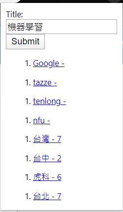

我會在許多平台上搜尋書籍。

為了節省在不同平台查詢的時間和節省視窗數量，因此開發這個專案。

只要輸入一次書名，就可以顯示在其他平台搜尋的結果網址。

但因為是第一次開發chrome插件，在使用上還是不太方便，點選一個超連結後視窗就會不見。

最後將這個功能移植到自己的網頁中。

I have many platform for books.

I don't want to open too many website tab, so create a chrome extension.

It make me just search the book once, and send result about url link.

But it still not very convenient.

Finally, i discontinue use this extension.

Migrate this function to my website.

* * *

